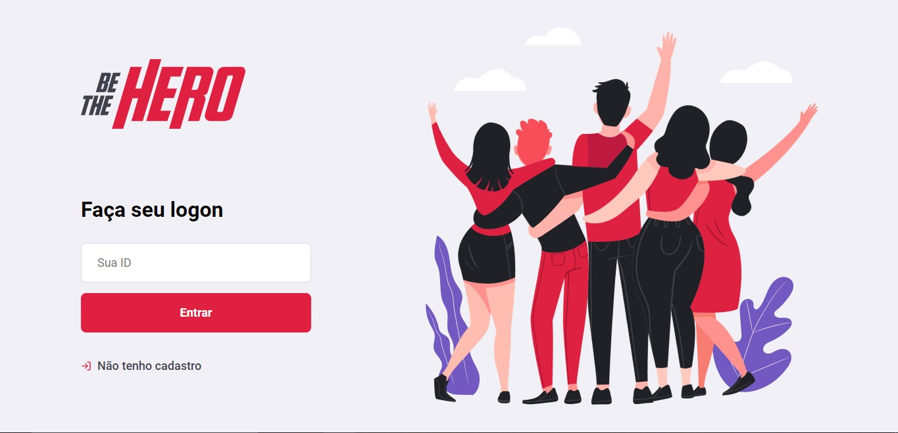
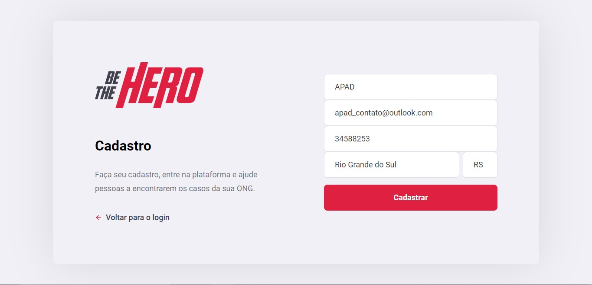
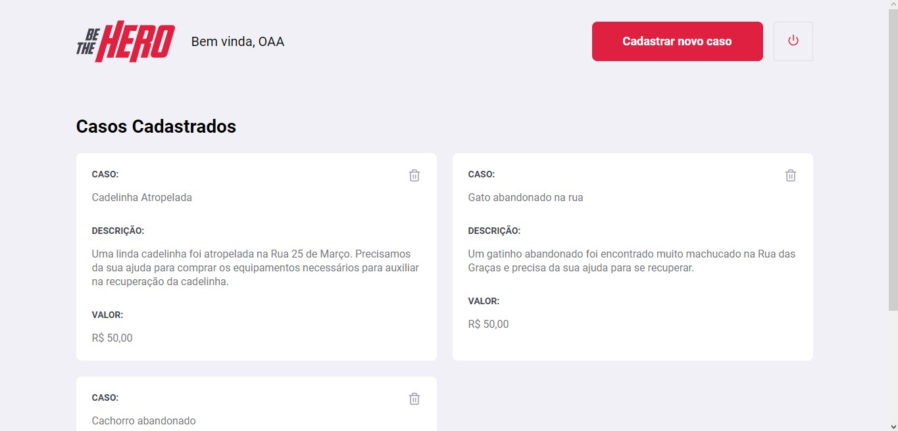
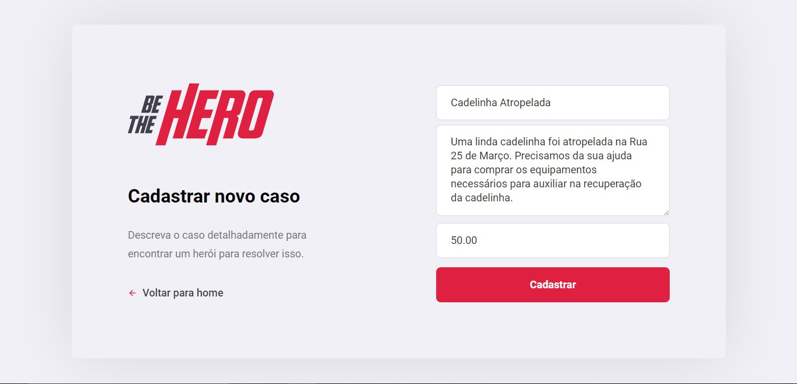
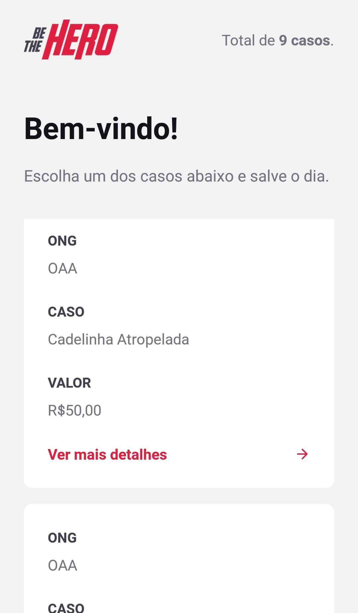
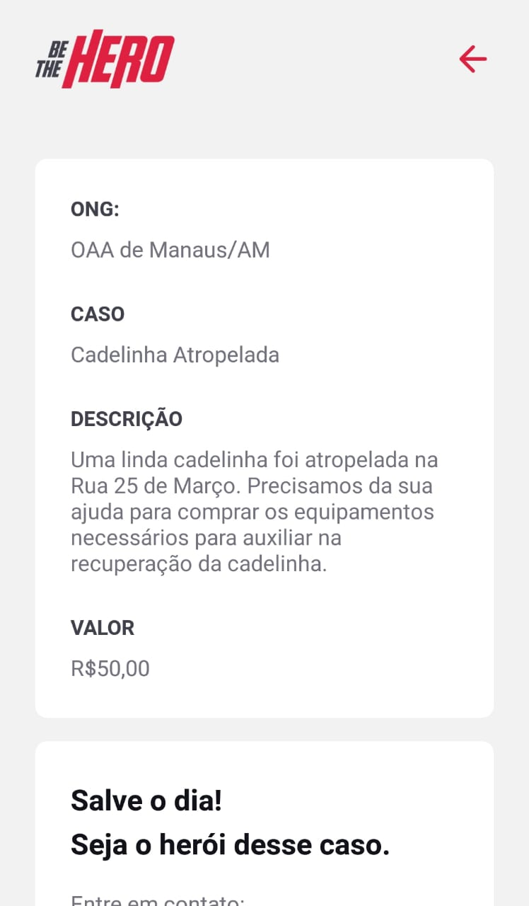
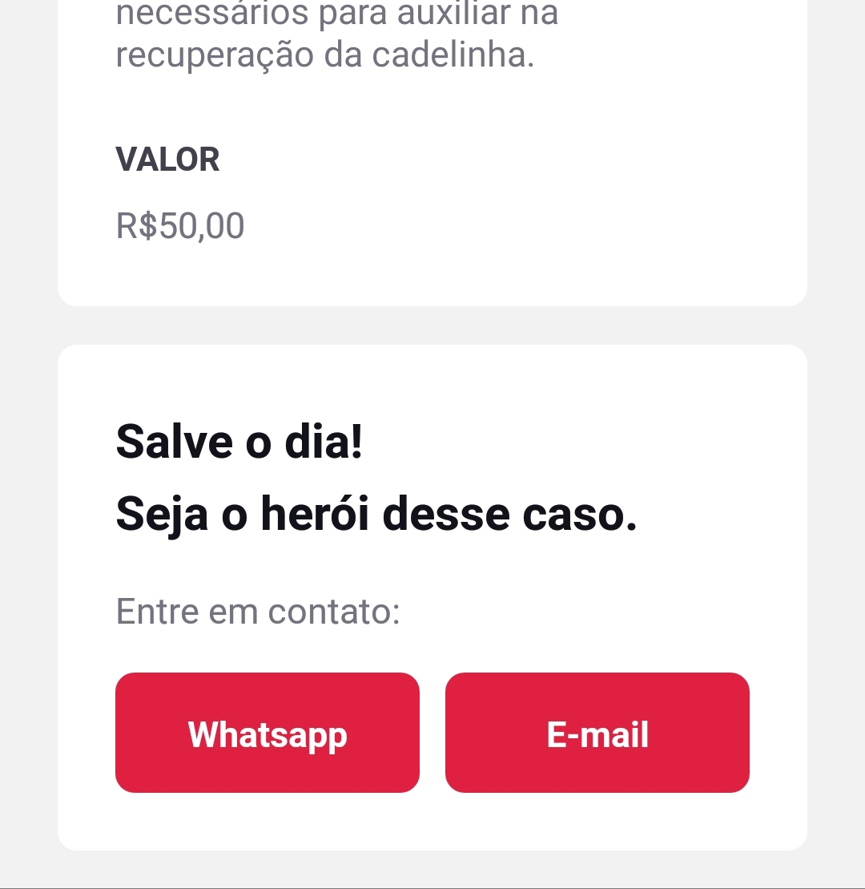

# Projeto Be The Hero

## Objetivo

Aprender tecnologias mais utilizadas no mercado como React e React Native, NodeJS e muito mais.

## O que é

Este projeto faz parte da Semana Omnistack da Rocketseat, que consiste em uma série de 5 vídeos, 1 por dia, em uma semana, ensinando a como trabalhar com as tecnologias mais utilizadas no mercado, tudo na prática. Neste repositório estão os arquivos tanto do frontend quanto do backend da aplicação, que é chamada de <em>Be the hero</em>.

A aplicação consiste em um sistema de ONGS que se cadastram no sistema e podem registrar incidentes aos quais elas trabalham, e usuários da aplicação mobile podem ver esses incidentes e entrar em contato com as respectivas ONGS para ajudar na causa.

## Tecnologias utilizadas

- React
- CSS3
- SCSS
- React Native
- Expo
- Intl
- Node
  - Express
  - Knex com SQLite3
  - Axios
  - Cors
  - Celebrate (Integração com Joi)
 

[Voltar ao topo](#projeto-be-the-hero)

## Imagens do projeto

### Versão Web
 

- 
Página de login

- 
Página de registro

- 
Página do perfil da ONG

- 
Página de criação de um novo caso

### Versão Mobile
 

- 
Página principal

- 
Página de detalhes do caso

- 
Página de detalhes do caso - Contato com a ONG

[Voltar ao topo](#projeto-be-the-hero)
